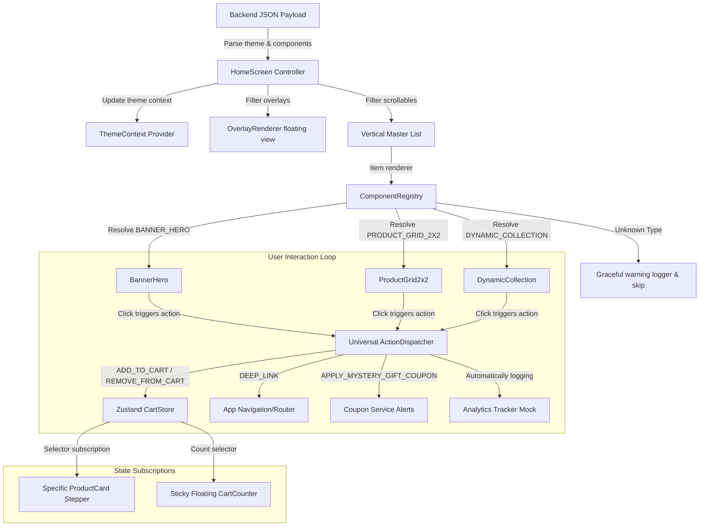

# Kiddo Server-Driven UI (SDUI) Quick-Commerce Engine

This repository contains a production-grade, highly optimized Server-Driven UI engine for **Kiddo**, a quick-commerce platform for baby and kid essentials. The engine is modeled after architecture used by Blinkit, Swiggy, Zomato, and Zepto to dynamically construct pages, styles, campaigns, and layouts directly from backend JSON configurations.

---

## 🏗️ System Architecture

The frontend functions as a **dumb renderer**. It receives a JSON feed containing theme parameters and layout widgets, resolves component representations, routes interactions through a central action dispatcher, and isolates state updates.

### SDUI Processing & Interaction Flow

---

## 🛠️ Engine Architecture Details

### 1. Component Registry & Resiliency
- **Dynamic Resolver**: Components are registered in `src/registry/ComponentRegistry.ts`. The layout builder queries the registry to map layout string keys to React components.
- **Fail-Safe Mechanism**: If an unsupported type is received (e.g. `NEW_COMPONENT_V2`), the renderer writes a warning entry to the console logger and skips rendering instead of throwing layout crashes.

### 2. Universal Action Dispatcher
- **Decoupled Components**: Components do not trigger business logic or mutate states directly. Every tap invokes `handleAction(action)` in `src/actions/ActionDispatcher.ts`.
- **Supported Operations**:
  - `ADD_TO_CART`: Increments quantity.
  - `REMOVE_FROM_CART`: Decrements quantity.
  - `DEEP_LINK`: Redirects to categories or details.
  - `APPLY_MYSTERY_GIFT_COUPON`: Claims discount codes.
  - `ANALYTICS_EVENT`: Logs tracking metrics.

### 3. Dynamic Theme Engine
- **Active Theme Provider**: Configured in `src/context/ThemeContext.tsx`. When a backend payload is loaded, its theme object (`primary`, `background`) is pushed to the context state, instantly recoloring buttons, badges, backgrounds, and headers across all children without code modifications.

### 4. Campaign Engine
- **Dev-Suite Switcher**: Switch layouts on the fly using the floating developer menu at the bottom.
- **Included Campaigns**:
  - **Kiddo Default Store**: Soft orange/cream theme with over 40 essentials.
  - **Back To School Sale**: Yellow bg/blue accents, school bag grids, and a floating paper airplane Lottie animation.
  - **Summer Playhouse**: Cyan bg, ticket dynamic collections, and a water splash Lottie animation.
  - **Mystery Gift Carnival**: Deep red bg, coupon code banners, gold boxes, and a confetti Lottie animation.

---

## ⚡ Performance Optimization Guidelines

To achieve fluid 60FPS scroll performance in quick-commerce home feeds, we implement strict React Native rendering constraints:

1. **State Isolation (Zustand Selectors)**:
   - Instead of subscribing to the entire cart store, components query slice variables (e.g., `useCartStore(selectProductQuantity(productId))`).
   - If product A is added to the cart, the card for product B **does not re-render**.
2. **React.memo & useCallback**:
   - Every list node (cards, banners, grids) is wrapped in `React.memo` to skip diffing unless props change.
   - Click handlers are wrapped in `useCallback` to avoid prop churn.
3. **Double Scroll Nesting Avoidance**:
   - The master homepage uses a single vertical `@shopify/flash-list`.
   - Horizontal carousels inside collections scroll independently on the X-axis, preventing virtualized layout glitches.
4. **Estimated Layout Heights**:
   - Item dimensions are configured via `overrideItemLayout` to enable instant recycler measurements.
5. **Overlay Viewport Separation**:
   - Full-screen overlays are filtered out of the list and float as absolute layers using `pointerEvents="none"` so touch gestures pass directly to underlying product elements.
